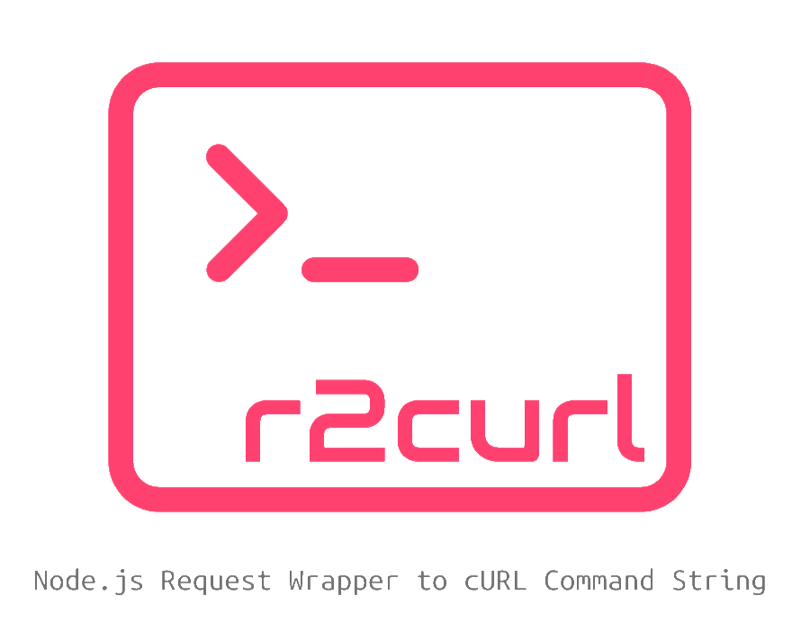

# r2curl

[](https://badge.fury.io/js/r2curl) [](https://opensource.org/licenses/mit-license.php) [](https://circleci.com/gh/uyu423/r2curl) [](https://www.codacy.com/app/uyu423/r2curl?utm_source=github.com&amp;utm_medium=referral&amp;utm_content=uyu423/r2curl&amp;utm_campaign=Badge_Grade) [](https://codeclimate.com/github/uyu423/r2curl) [](https://codeclimate.com/github/uyu423/r2curl/test_coverage)

<p align="center">
  
</p>

## Background

- [r2curl](https://github.com/uyu423/r2curl) was inspired by [@delirius325/axios-curlirize](https://github.com/delirius325/axios-curlirize).
- axios-curlirize is very convenient. but works as a middleware for axios, and I think this part is black box logic 
  - it contains potentially asynchronous concurrency issues and difficult-to-manage elements.
- So I created a new 'Request to cURL' package that is completely independent of the dependencies of axios.

## Feature

- Generates cURL commands completely independently from the outside of the request wrapper package.
- Provides additional options involved in generating the cURL command.
- It will be updated soon to be available in packages like [node-fetch](https://www.npmjs.com/package/node-fetch) or [request](https://www.npmjs.com/package/request).

## Roadmap

  - [x] [axios](https://www.npmjs.com/package/axios)
    - [x] AxiosRequestConfig
    - [x] AxiosResposne
  - [ ] [node-fetch](https://www.npmjs.com/package/node-fetch)
  - [ ] [request](https://www.npmjs.com/package/request)
  - [ ] ...

## Usage

### axios

#### `AxiosResponse`

```typescript
// if js, const r2curl = require('r2curl');
import r2curl from 'r2curl';

const response = await axios.get('https://google.com');
const curl = r2curl(response);

console.log(curl);
// stdout "curl -X GET 'https://google.com' -H 'Accept:application/json, text/plain, */*' -H 'User-Agent:axios/0.18.0'"
```

#### `AxiosRequestConfig`

```typescript
// if js, const r2curl = require('r2curl');
import r2curl from 'r2curl';

// config as AxiosRequestConfig
const config = {
  url: 'https://google.com',
  method: 'POST',
  data: {
    caller: 'curl tester',
  },
  headers: {
    'Content-Type': 'application/json',
  },
};

const curl = r2curl(reqeustConfig);
console.log(curl);
// stdout `curl -X POST 'https://google.com' -H 'Content-Type:application/json' --data '{"caller":"curl tester"}'`

const response = await axios.request(config);
```

### node-fetch

- update soon (target 0.2.0)
- see [github project board](https://github.com/uyu423/r2curl/projects/1)

### request

- update soon (target 0.2.0)
- see [github project board](https://github.com/uyu423/r2curl/projects/1)

## More `r2curl` Options

### `option.quote`

- Determines the type of quota around the body and uri.
- default is `single`

```typescript
import r2curl from 'r2curl';

// option as IR2CurlOptions.ts
const option = {
  /** Determines the type of quota around the body and uri. */
  quote: 'double',
};

const curl = r2curl(requestConfig, option);
console.log(curl); 
```

### `option.defaultContentType`

- Determines the default Content-Type header value for `POST` and `PUT` requests.
- default is `application/json; charset=utf-8`
- Type is `(enum) HEADER_CONTENT_TYPE` | `string` | `false`;
- If you give `(boolean) false` to `defaultContentType`, you can disable `Content-Type` Header.

```typescript
import r2curl, { HEADER_CONTENT_TYPE } from 'r2curl';

// const optionUsingEnum = {
//   defaultContentType: HEADER_CONTENT_TYPE.TEXT,
// };
const option = {
  defaultContentType: 'application/json5',
}
const request: AxiosRequestConfig = { url: 'https://google.com', method: 'POST' };

const curl = r2curl(config, option);
console.log(curl); 
// output: curl -X POST 'https://google.com' -H 'Content-Type:application/json5
```

### `option.forceBody`

- Accept Body all HTTP Method.
- By default, Body is not allowed in `GET` and `DELETE` methods.
- However, some services such as ElasticSearch should be able to use the Body as a `GET` method. At this point, use this option to activate the Body.

```typescript
import r2curl from 'r2curl';

const config: AxiosRequestConfig = {
  url: 'https://google.com',
  method: 'GET',
  data: {
    caller: 'https://github.com/uyu423/r2curl',
    sorry: true,
  },
};

const option = {
  forceBody: true,
}

const curl = r2curl(config, option);
// output: 'curl -X GET \'https://google.com\' --data \'{"caller":"https://github.com/uyu423/r2curl","sorry":true}\''
```